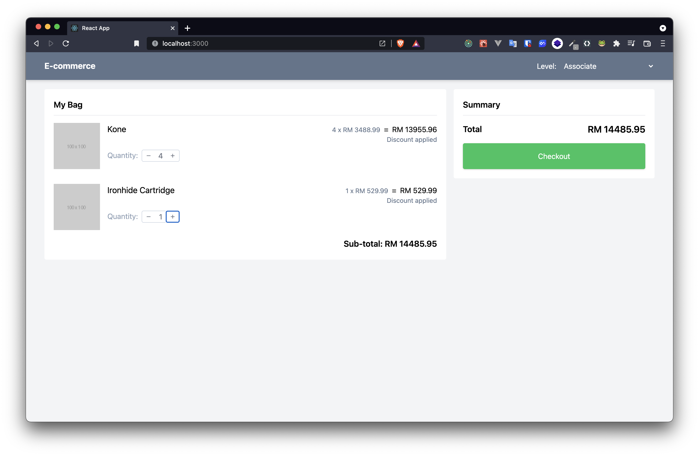
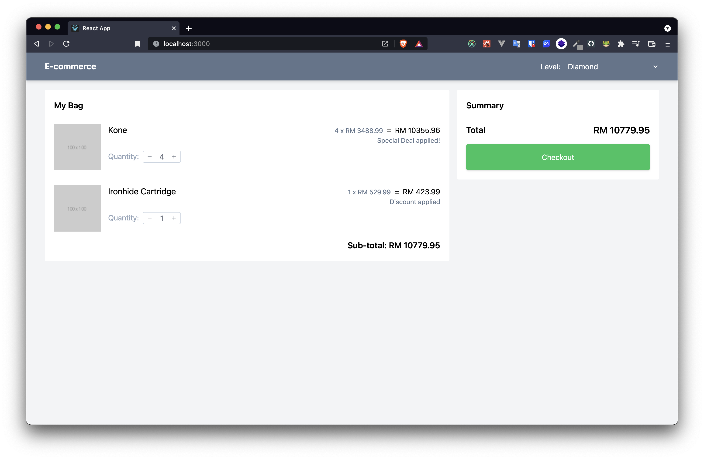
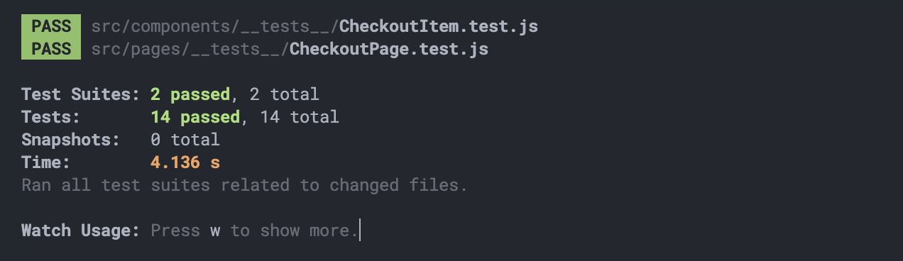

# Checkout System

This project implements the checkout logic with discount and deals applied.

## Project setup

-   Run `npm install`
-   Run `npm start`
-   Browser will be automatically launched. If not, go to `http://localhost:3000/`

## Project Detail

According to the level of the user (`Associate` or `Diamond`), the discounted amounts are pre-configured as `5%` for `Associate` and `20%` for `Diamond`.


Two products are initially included. Quantity can be increased or decreased by clicking on `+` and `-` buttons respectively for each product. Once quantity is greater than zero, different discount and deal logics will be applied.



For `Associate` user, only discount 5% will be applied for products.



For `Diamond` user, both special deals and discount logics will be considered and applied according to the quantity specified.

### Deals

-   Get a discount on Kone where 3 or more purchased. The price dropped to RM 2588.99 per unit
-   Get a 3 for 2 deal on Ironhide Cartridge

### Test case

-   RECIPIENT: Diamond
-   Cart Items: Kone, Kone, Kone, Kone, Ironhide Cartridge
-   Total Expected: RM 10779.95


For testing purpose, user level selector is included in the top right corner.

### Deals Negotiation

Currently, how to discount price according to deals is specified as below.

```
{
    id: 2,
    name: 'Ironhide Cartridge',
    price: 529.99,
    currency: 'RM',
    quantity: 0,
    discount: [
        // For Diamond Level user, if they buy 3 items, they will only have to pay for 2.
        {
            level: USER_LEVEL.DIAMOND,
            type: DISCOUNT_TYPE.DEAL,
            buy: 3,
            pay: 2,
        },
    ],
}
```

For easy configuration, different deal types can be specified to differnt level of users. Deal logic will be applied in calculating the subtotal.

## Testing

Testing is done by `@testing-library/react` and tests are defined in `__test__` folders for respective react functional components at both page level and component level. Tests can be checked by running `npm test` or `npm run test`.


